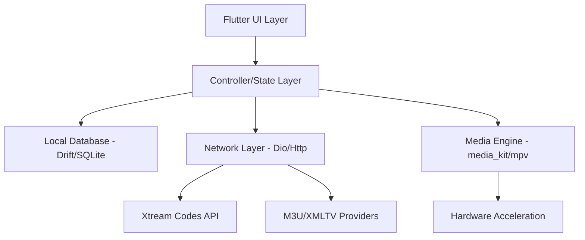

# DESIGN_BLUEPRINT.md

## Project Name
**Lumio Player**
*A Next-Generation, Open-Source, Cross-Platform IPTV Solution*

**Reference Repository:** [lumio-player](https://github.com/lumio/lumio-player)
**Goal:** To deliver a premium, enterprise-grade IPTV streaming experience across Mobile, Desktop, and TV platforms, with advanced features like Cloud Sync, EPG support, and a focus on accessibility and D-Pad navigation.

---

## Vision & MVP

### Vision
Lumio aims to bridge the gap between simple open-source players and high-end paid IPTV software. By leveraging Flutter and `media_kit`, it provides a unified experience that is fast, aesthetically pleasing, and technically robust enough for power users.

### Minimum Viable Product (MVP)
1.  **Universal Playlist Support:** M3U, M3U8, and Xtream Codes API compatibility.
2.  **Multichannel Content:** Live TV, Movies (VOD), and Series (with seasons/episodes).
3.  **Modern Player Core:** High-performance playback with track selection and "Continue Watching" logic.
4.  **Global Search:** Deep search across categories and playlists.
5.  **Multi-Platform:** Android (Phone/Tablet/TV), iOS, Windows, macOS, Linux.

---

## Architecture Overview

Lumio uses a layered architecture to ensure separation of concerns and maintainability.

### High-Level Architecture


### Core Technology Stack
- **State Management:** `Provider` / `ChangeNotifier` (Current) -> Evolving toward `Bloc` for complex flows.
- **Database:** `Drift` (SQLite) for high-performance reactive storage.
- **Media Engine:** `media_kit` (libmpv) for unmatched codec support and protocol compatibility (RTSP/RTMP/UDP).
- **Dependency Injection:** `get_it`.
- **Sync:** Firebase Auth + Firestore (Planned).

---

## Feature Specifications

### 1. Playlist Import & Management
- **Description:** Advanced UI to add, edit, or delete multiple IPTV sources.
- **Tech Requirements:**
  - Robust parser for `#EXTM3U` and `#EXTINF` tags.
  - Periodic refresh background tasks.
  - Playlist validation before ingestion.

### 2. EPG (Electronic Program Guide)
- **Description:** Full-featured grid showing "What's on" with EPG data from XMLTV (standard and GZIP).
- **User Story:** "As a TV viewer, I want to scroll through a timeline to see the schedule for the next 24 hours."
- **Tech Requirements:**
  - `xml` package for parsing.
  - Stream-based ingestion to handle large XML files (50MB+).
  - Fuzzy matching between EPG `tvg-id` and Playlist Channel names.

### 3. Advanced Player Controls
- **Enhanced Protocols:** Support for RTSP, RTP, UDP, and HTTP streams via mpv's native capabilities.
- **Customization:**
  - **Audio/Subtitle Track Selector:** dynamic switching during playback.
  - **Subtitle Styling:** Font size, color, and background adjustments.
  - **Playback Speed:** 0.5x to 2.0x.

### 4. Cloud Sync & Auth
- **Backend:** Firebase.
- **Features:**
  - Sync **Favorites**, **Watch History**, and **Playlists** (metadata only).
  - Account profiles for multiple users on the same device (TV setup).

---

## Database Schema & Models

### Entity Relationship Diagram
```mermaid
erDiagram
    PLAYLIST ||--o{ CATEGORY : contains
    PLAYLIST ||--o{ LIVE_STREAM : provides
    PLAYLIST ||--o{ VOD_STREAM : provides
    PLAYLIST ||--o{ SERIES : provides
    LIVE_STREAM ||--o? EPG_CHANNEL : linked_to
    EPG_CHANNEL ||--o{ EPG_PROGRAM : scheduled_with
    WATCH_HISTORY }|--|| PLAYLIST : tracks
    FAVORITE }|--|| PLAYLIST : marks
```

### Key Models
- **Playlist:** Store credentials, metadata, and local state.
- **M3uItem / LiveStream:** Unit of content with URL and categorisation.
- **EpgProgram:** Time-bound entry for a specific channel.
- **WatchHistory:** Progress in seconds, last access timestamp.

---

## UI/UX Design Guidance

### TV / D-Pad Navigation Support (Leanback UI)
- **Focus System:** Every interactive tile must have a clear visual focus state (glow, border, or scaling).
- **Navigation:**
  - `LogicalKeySet` for handling remote control buttons (Select, Back, Play/Pause).
  - Left Sidebar focus for quick switching between Live, Movies, and Series.
- **EPG Grid:** Optimized for D-Pad scrolling (horizontal for time, vertical for channels).

### Adaptive Layouts
- **Mobile:** Bottom navigation bar for one-handed use.
- **Desktop:** Multi-pane layouts (category list + content grid).
- **Accessibility:** Large font support, high-contrast modes, and RTL (Right-to-Left) support for Arabic/Hebrew users.

---

## Sync & Offline Strategy
- **Local-First:** All operations happen locally in SQLite for zero latency.
- **Background Sync:** Use `workmanager` to sync local changes to Firestore when online.
- **EPG Caching:** Store program data for 7 days; auto-purge expired entries.

---

## Project Roadmap & Milestones

| Phase | Focus | Key Deliverables |
| :--- | :--- | :--- |
| **Phase 1** | **Core** | M3U/Xtream support, basic player, favorites. |
| **Phase 2** | **EPG & TV** | XMLTV parsing, EPG grid UI, D-Pad focus navigation. |
| **Phase 3** | **Cloud & Polish** | Firebase sync, multi-language (l10n), production releases. |

---

## Tasks & Issues (Actionable)

| ID | Task Title | Description | Est. | Priority |
| :--- | :--- | :--- | :--- | :--- |
| T1 | XMLTV GZIP | Support `.xml.gz` ingestion in EpgService. | Medium | High |
| T2 | TV Focus | Implement visual focus indicators across all screens. | Medium | High |
| T3 | Firebase | Setup Auth and Firestore sync logic. | Large | Medium |
| T4 | l10n | Add localized strings for TR, AR, ES, FR. | Small | Medium |
| T5 | Subtitle UI | Create in-player menu for subtitle customization. | Small | Medium |

---

## Testing Strategy
- **Unit:** Parser logic (M3U, XMLTV, API responses).
- **Widget:** UI responsiveness, focus traversal, theme switching.
- **Integration:** End-to-end stream playback from login to video start.
- **Platform-Specific:** Test on physical FireTV or Android TV for remote control lag.

---

## Packaging & Deployment
- **CI/CD:** GitHub Actions configured for multi-arch APKs, DMG for macOS, and MSI for Windows.
- **Distribution:** Play Store, F-Droid, and direct GitHub releases.

---

## Contribution Guidelines
1. **Consistency:** Follow the lint rules defined in `analysis_options.yaml`.
2. **Commit Style:** Use Conventional Commits (`feat:`, `fix:`, `docs:`).
3. **PR Logic:** Small, focused PRs with screenshots for UI changes.
